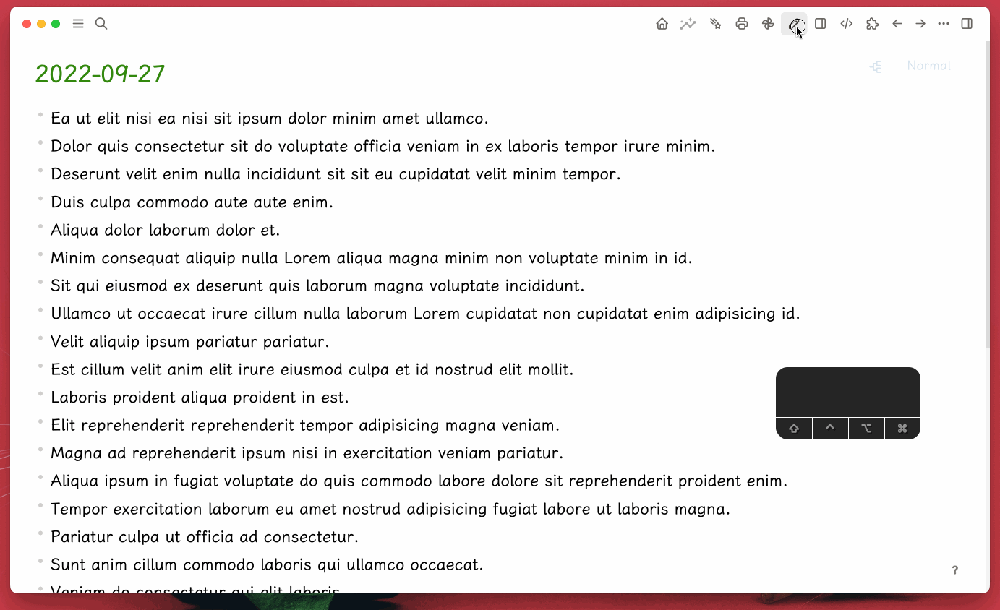

# Logseq Plugin Pen

A Logseq plugin to provide a pen.

## Usage

Click the pen icon to open the pen mode, and then draw any supported style on it, you can toggle the transparent background to white.

## Buy me a coffee

If my plugin solve your situation a little bit and you will, you can choose to buy me a coffee via [this](https://www.buymeacoffee.com/vipzhicheng) and [this](https://afdian.net/@vipzhicheng).

## Licence
MIT
